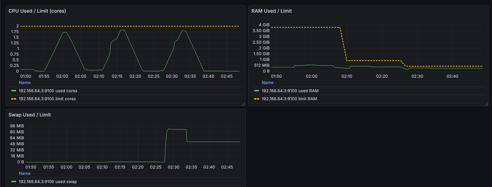
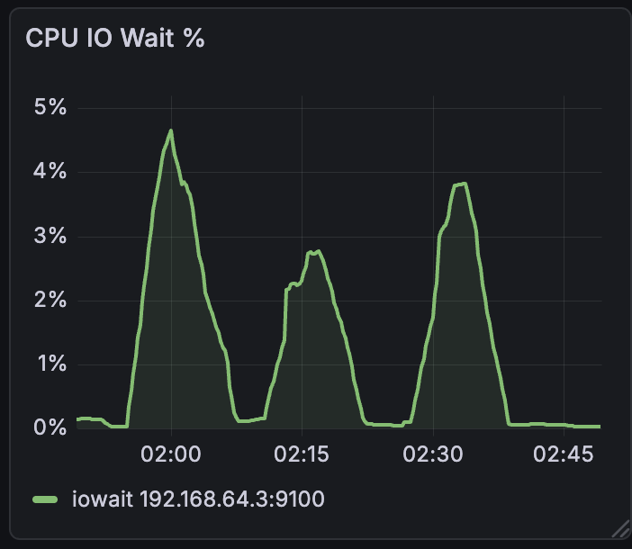
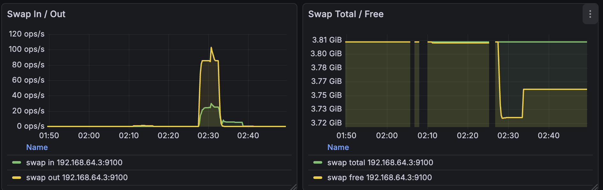
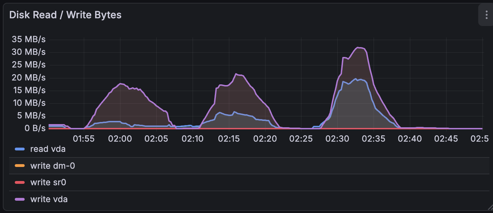

# I. Отчет по сравнительному нагрузочному тестированию PostgreSQL в OS Ubuntu Server и Windows 11 Home

## 1. Цель тестирования

При стабильной нагрузке PostgreSQL определить, как тип ОС влияет на производительность базы данных при прочих равных условиях:
- Windows 11-arm64 Home
- Ubuntu 24.04.4-live-server-arm64

---

## 2. Методика тестирования

### Инструменты

**Мониторинг утилизации ресурсов:**
- Windows: typeperf - мониторинг утилизации ресурсов CPU, memory
- Linux: dstat - мониторинг утилизации ресурсов CPU, memory
- Метрики HammerDB: **NOPM** — New Orders Per Minute, **TPM** — Transactions Per Minute

### Тестовое окружение

**Хостовая машина:**

- ОС: macOS 26.3.1
- ЦП: Apple M4
- ОЗУ: 16 ГБ

**Инфраструктура и ПО:**

- Гипервизор: UTM
- СУБД: PostgreSQL 18
- Нагрузочный генератор: HammerDB в контейнере Docker
- VM 1: Windows 11-arm64 Home (2 CPU, 4 GB RAM)
- VM 2: Ubuntu 24.04.4-live-server-arm64 (2 CPU, 4 GB RAM)

### Профиль нагрузки

Параметры нагрузочного теста:

- Тип теста: TPROC-C (тест стабильности)
- Количество виртуальных пользователей: 5
- Время разогрева: 1 минута
- Длительность теста (одного прогона): 5 минут

---

## 3. Результаты

### Windows

| Прогон | NOPM | TPM |
|--------|------|-----|
| 1 | 7050 | 16408 |
| 2 | 7095 | 16259 |

Среднее:
- NOPM: **7072**
- TPM: **16333**

---

### Ubuntu

| Прогон | NOPM | TPM |
|--------|------|-----|
| 1 | 24485 | 56277 |
| 2 | 18343 | 42186 |

Среднее:
- NOPM: **21414**
- TPM: **49231**

---

## 4. Графики

### CPU
Windows:  

Ubuntu:  

Описание:
- Linux — не превышает 80% утилизации CPU, что на практике хороший показатель.
- Windows — CPU стабильно в сотке, ресурсов CPU недостаточно.

---

### Memory
Windows:  

Ubuntu:  

Описание:
- Windows — не превышает 80% утилизации Memory, что на практике хороший показатель.
- Linux — не превышает 10-11% утилизации Memory, что на практике означает требование срезать ресурсы RAM для экономии средств.

---

## 5. Анализ

| Метрика | Windows | Ubuntu | Разница |
|--------|--------|--------|--------|
| NOPM | ~7k | ~21k | x3 |
| TPM | ~16k | ~49k | x3 |

Ubuntu показывает примерно **в 3 раза лучшую пропускную способность**, чем Windows, при равных условиях.

---

## 6. Выводы

- Linux значительно быстрее Windows при стабильной нагрузке базы данных PostgreSQL
- Windows требует дополнительной оптимизации
- Linux предпочтителен для PostgreSQL

---

## 7. Итог

 Пропускная способность PostgreSQL на Linux ≈ **в 3 раза выше**, чем на Windows. 
 *Ограничение: CPU Windows VM во время теста стабильности был в сотке, что на практике является инцидентом – ситуацией, когда пропадает гарантия правильной работы сервиса по SLA.*

---

# Оптимизация параметров ВМ. Подбор ресурсов ВМ

### Выбор ОС

Для тестирования выбрана Linux (Ubuntu Server), так как:
- ниже накладные расходы
- лучше подходит для серверных нагрузок
- стабильная работа PostgreSQL

---

### Методика тестирования

Использовался HammerDB (TPROC-C):

- Тип теста: TPROC-C
- Профиль нагрузки: см. выше
- Параметры одинаковые для всех запусков

---

### Конфигурации ВМ

1 тест:
- 2 vCPU
- 4 GB RAM

2 тест:
- 2 vCPU
- 1 GB RAM

3 тест:
- 2 vCPU
- 512 MB RAM

---

### Результаты тестирования

| Конфигурация | NOPM | TPM |
|--------------|------|------|
| 2 CPU / 4 GB | 23785 | 54610 |
| 2 CPU / 1 GB | 25831 | 59446 |
| 2 CPU / 512 MB | 23994 | 55272 |

---

## Мониторинг ресурсов

### CPU

- загрузка до ~1.8 core
- CPU не является bottleneck

---

### RAM

- при 4 GB используется ~500 MB
- при 1 GB используется эффективно
- при 512 MB нехватка памяти

---

### Swap

- при 512 MB появляется swap (~80–90 MB) из-за ограничений оперативки
- swap ухудшает производительность, I/O с диска дольше

---

### CPU IO Wait

- пики до 4–5%
- влияние диска

---

### Swap In / Out

- swap out до ~100 ops/sec
- активный swap = деградация

---

### Disk I/O

- пики до ~30 MB/s
- диск участвует в нагрузке

---

## Анализ

### RAM

- 4 GB не дает прироста
- 1 GB лучший результат
- 512 MB деградация

---

### Swap

- увеличивает latency
- повышает iowait
- снижает TPS

---

### CPU

- не загружен полностью
- не является узким местом

---

## Оптимальная конфигурация

2 CPU / 1 GB RAM

- максимальный NOPM и TPM
- нет swap
- эффективное использование ресурсов

---

## Выводы по этапу 3

- больше ресурсов != быстрее
- избыток RAM бесполезен
- недостаток RAM вызывает swap
- важен баланс

---

### Наблюдения

- 1 GB RAM лучший результат
- 4 GB избыточен
- 512 MB недостаточно
- CPU не bottleneck
- диск влияет через swap

---

## Рекомендации

- использовать 2 CPU / 1 GB RAM при данном профиле нагрузки
- оптимизировать PostgreSQL:
  - shared_buffers
  - work_mem