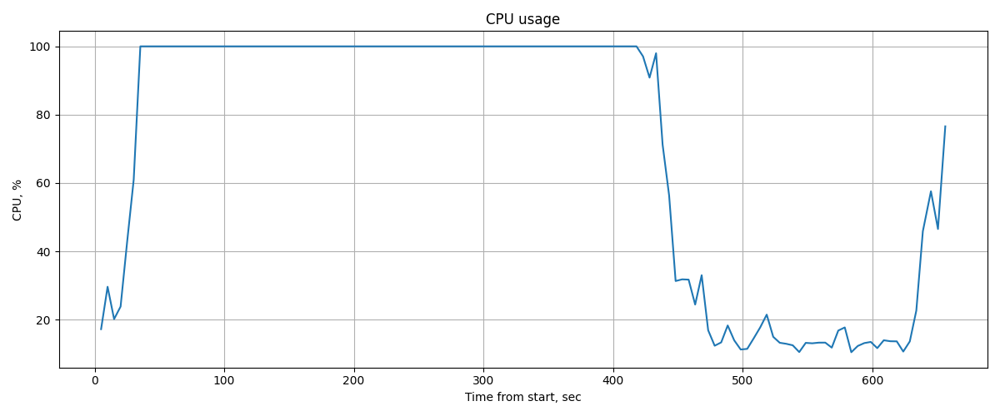
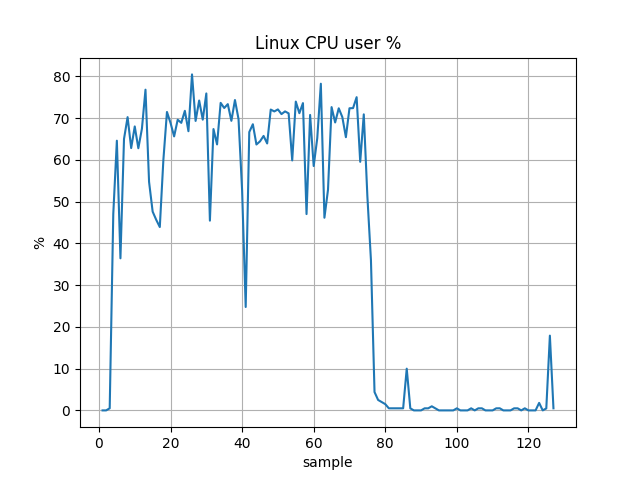
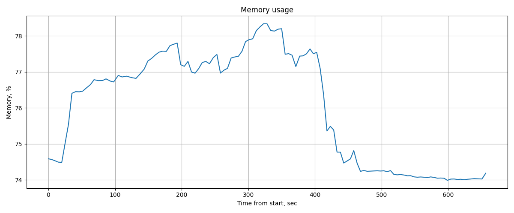
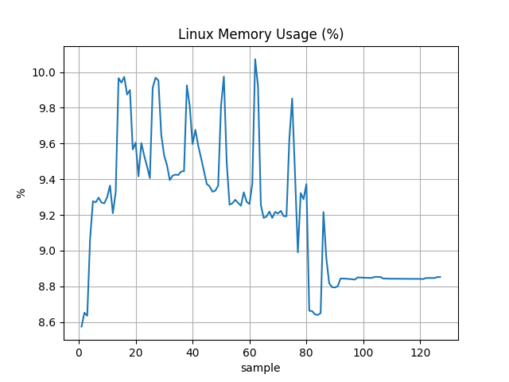

# I. Отчет по сравнительному нагрузочному тестированию PostgreSQL в OS Ubuntu Server и Windows 11 Home

## 1. Цель тестирования

При стабильной нагрузке PostgreSQL определить, как тип ОС влияет на производительность базы данных при прочих равных условиях.

- Windows 11-arm64 Home
- Ubuntu 24.04.4-live-server-arm64

Метрики:
- **NOPM** — New Orders Per Minute
- **TPM** — Transactions Per Minute

---

## 2. Методика тестирования

### Инструменты

**Мониторинг утилизации ресурсов:**
- Windows: typeperf - мониторинг утилизации ресурсов
- Linux: dstat - мониторинг утилизации ресурсов

### Тестовое окружение

**Хостовая машина:**

- ОС: macOS 26.3.1
- ЦП: Apple M4
- ОЗУ: 16 ГБ

**Инфраструктура и ПО:**

- Гипервизор: UTM
- СУБД: PostgreSQL 18
- Нагрузочный генератор: HammerDB в контейнере Docker
- VM 1: Windows 11-arm64 Home (2 CPU, 4 GB RAM)
- VM 2: Ubuntu 24.04.4-live-server-arm64 (2 CPU, 4 GB RAM)

### Профиль нагрузки

Параметры нагрузочного теста:

- Тип теста: TPROC-C (тест стабильности)
- Количество виртуальных пользователей: 5
- Время разогрева: 1 минута
- Длительность теста (одного прогона): 5 минут

---

## 3. Результаты

### Windows

| Прогон | NOPM | TPM |
|--------|------|-----|
| 1 | 7050 | 16408 |
| 2 | 7095 | 16259 |

Среднее:
- NOPM: **7072**
- TPM: **16333**

---

### Ubuntu

| Прогон | NOPM | TPM |
|--------|------|-----|
| 1 | 24485 | 56277 |
| 2 | 18343 | 42186 |

Среднее:
- NOPM: **21414**
- TPM: **49231**

---

## 4. Графики

### CPU
Windows:  

Ubuntu:  

Описание:
- Linux — не превышает 80% утилизации CPU, что на практике хороший показатель.
- Windows — CPU стабильно в сотке, ресурсов CPU недостаточно.

---

### Memory
Windows:  

Ubuntu:  

Описание:
- Windows — не превышает 80% утилизации Memory, что на практике хороший показатель.
- Linux — не превышает 10-11% утилизации Memory, что на практике означает требование срезать ресурсы RAM для экономии средств.

---

## 5. Анализ

| Метрика | Windows | Ubuntu | Разница |
|--------|--------|--------|--------|
| NOPM | ~7k | ~21k | x3 |
| TPM | ~16k | ~49k | x3 |

Ubuntu показывает примерно **в 3 раза лучшую пропускную способность**, чем Windows, при равных условиях.

---

## 6. Выводы

- Linux значительно быстрее Windows при стабильной нагрузке базы данных PostgreSQL
- Windows требует дополнительной оптимизации
- Linux предпочтителен для PostgreSQL

---

## 7. Итог

 Пропускная способность PostgreSQL на Linux ≈ **в 3 раза выше**, чем на Windows. 
 *Ограничение: CPU Windows VM во время теста стабильности был в сотке, что на практике является инцидентом – ситуацией, когда пропадает гарантия правильной работы сервиса по SLA.*
